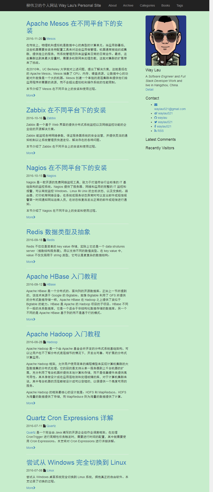
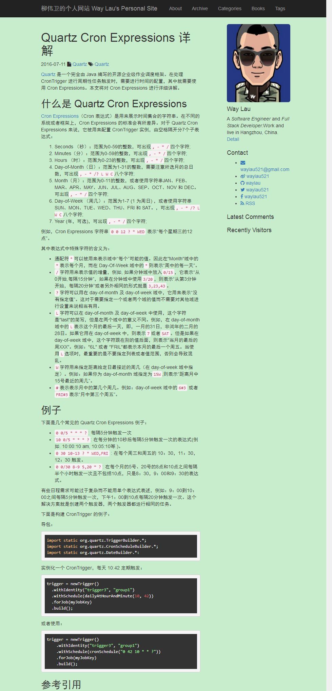

# jekyll-bootstrap-blog

A theme for Jekyll to build a personal blog, based on [Bootstrap 3](http://getbootstrap.com/), [Font Awesome](http://fortawesome.github.io/Font-Awesome/) and [jQuery](http://jquery.com/).  

* Clean
* Responsive
* Mobile First
* Syntax Highlighting 
* Jekyll 3 Supported
* SEO Friendly

## Screenshots





## Demo

You can see the theme running on [my blog](https://waylau.com/).

<!-- more -->

## Usage

### Installation

- Start by cloning the github repo using `git clone`
- You must have jekyll installed to run this, use `gem install jekyll` for installing it
- Use `jekyll serve` to run the site live.

### Configration

```
# Site settings
title: Way Lau's Personal Site
name: Way Lau's Personal Site
url: "http://www.waylau.com"
email: waylau521@gmail.com
description: Way Lau's Personal Site | www.waylau.com.
baseurl: "" # the subpath of your site, e.g. /blog/
twitter_username: waylau521
github_username:  waylau
weibo_username: waylau521
facebook_username: waylau521
duoshuo_username: waylau
baidushare_id: 89860593
baidutongji_id: 28cf5fa48a599e39c5cc760931de942f
rss_url: "/feed.xml"
logo_image: "/images/logo.png"
# Build settings
gems: [jekyll-paginate]
markdown: rdiscount
highlighter: pygments
permalink: /:title/
paginate: 8
paginate_path: page/:num
```

### Creating Posts

For creating posts add this snippet in front of your post's markdown file:

```
---
layout: post
title:  "your title here"
tags: your tags here
class: post
---
```

Add content below this and save the post in `_posts` directory (you will have to create it).

### Page excluded from top bar nav

By default, created pages will show on the top bar nav. If you want page excluded from top bar nav, you just add`excludedFromNav: true` in the page as below: 

```
---
layout: page
title: Labs
permalink: /labs/
excludedFromNav:true
---
```

## License

Feel free to fork and contribute to the project, just create a pull request.

Open sourced under [MIT License](LICENSE) 

